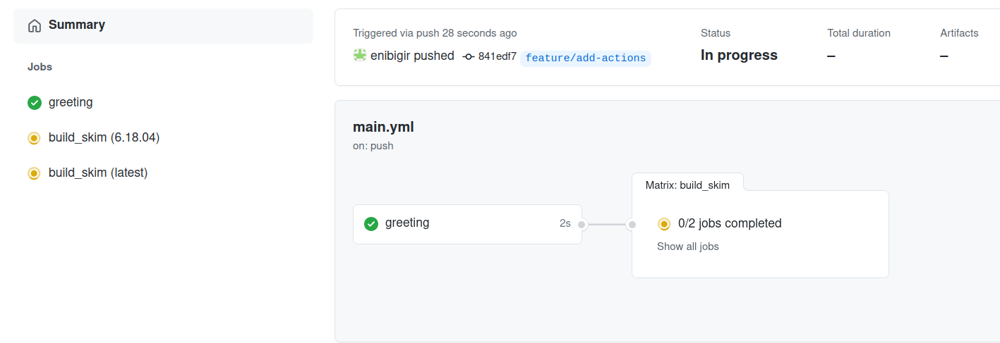

# Dependent Jobs

:::{admonition} Overview
:class: note
**Teaching:** 5 min | **Exercises:** 5 min

**Questions**
- How do you make some jobs run after other jobs?

**Objectives**
- Run some jobs in serial.
:::

## Defining dependencies

From the last session, we're starting with

```yaml
jobs:
  greeting:
   runs-on: ubuntu-latest
   steps:
     - run: echo hello world

 build_skim:
   runs-on: ubuntu-latest
   container: rootproject/root:${{ matrix.version }}
   strategy:
     matrix:
       version: [6.26.10-conda, latest]
   steps:
     - name: checkout repository
       uses: actions/checkout@v4

     - name: build
       run: |
        COMPILER=$(root-config --cxx)
        FLAGS=$(root-config --cflags --libs)
        $COMPILER -g -O3 -Wall -Wextra -Wpedantic -o skim skim.cxx $FLAGS
```

We're going to talk about another useful parameter `needs`.

:::{admonition} Specify dependencies between jobs
:class: tip
The key-value `needs: job or list of jobs` allows you to specify dependencies between jobs in the order you define.
<br/>Example:
```yaml
job2:
  needs: job1
```
job2 waits until job1 completes successfully. [Further reading](https://docs.github.com/en/actions/reference/workflow-syntax-for-github-actions#jobsjob_idneeds).
:::

::::{admonition} Dependent jobs
:class: important
How to make `build_skim` job to run after `greeting`?

:::{admonition} Solution
:class: dropdown
```yaml
jobs:
 greeting:
   runs-on: ubuntu-latest
   steps:
     - run: echo hello world

build_skim:
  needs: greeting
  runs-on: ubuntu-latest
  container: rootproject/root:${{ matrix.version }}
  strategy:
    matrix:
      version: [6.26.10-conda, latest]
  steps:
    - name: checkout repository
      uses: actions/checkout@v4

    - name: build
      run: |
        COMPILER=$(root-config --cxx)
        FLAGS=$(root-config --cflags --libs)
        $COMPILER -g -O3 -Wall -Wextra -Wpedantic -o skim skim.cxx $FLAGS
```
:::
::::

Let's go ahead and add those changes and look at GitHub.
```bash
git add .github/workflows/main.yml
git commit -m "add dependent jobs"
git push -u origin feature/add-actions
```



:::{admonition} Key Points
:class: note
- We can specify dependencies between jobs running in a series using the needs value.
:::
