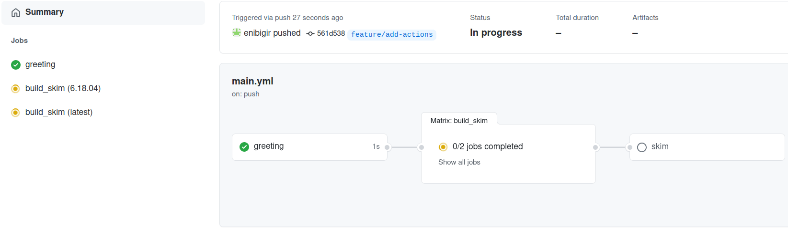
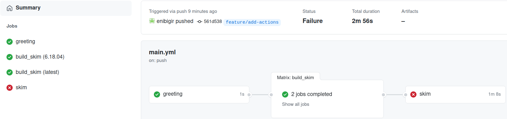

# A Skimmer Higgs

:::{admonition} Overview
:class: note
**Teaching:** 5 min | **Exercises:** 10 min

**Questions**
- How can I run my skimming code in the GitHub Actions?

**Objectives**
- Learn how to skim code and set up artifacts.
:::

## The First Naive Attempt

Let's just attempt to try and get the code working as it is. Since it worked for us already locally, surely the CI/CD must be able to run it?

As a reminder of what we've ended with from the last session:

```yaml
jobs:
  greeting:
    runs-on: ubuntu-latest
    steps:
      - run: echo hello world

  build_skim:
    needs: greeting
    runs-on: ubuntu-latest
    container: rootproject/root:${{ matrix.version }}
    strategy:
      matrix:
        version: [6.26.10-conda, latest]
    steps:
      - name: checkout repository
        uses: actions/checkout@v4

      - name: build
        run: |
          COMPILER=$(root-config --cxx)
          FLAGS=$(root-config --cflags --libs)
          $COMPILER -g -O3 -Wall -Wextra -Wpedantic -o skim skim.cxx $FLAGS
```

Since the `skim` binary is built, let's see if we can run it. We need to add a job , with name `skim`.

`skim` is meant to process data (skimming) we are going to run on.

Let's go ahead and figure out how to define a run job. Seems too easy to be true?
```yaml
skim:
  needs: build_skim
  runs-on: ubuntu-latest
  container: rootproject/root:6.26.10-conda
  steps:
      - name: checkout repository
        uses: actions/checkout@v4

      - name: skim
        run: ./skim
```

After you've added the `skim` job you can push your changes to GitHub:
```bash
git add .github/workflows/main.yml
git commit -m "add skim job"
git push -u origin feature/add-actions
```





:::{admonition} Failed???
:class: important
Let's have a look at the log message
```text
./skim: not found
```
:::

## We're too naive

Ok, fine. That was way too easy. It seems we have a few issues to deal with. The `skim` binary in the `build_skim` job isn't in the `skim` job by default. We need to use GitHub `artifacts` to copy over this from the right job.

### Artifacts

Artifacts are used to upload (`upload-artifact`) and download  (`download-artifact`) files and directories which should be attached to the job after this one has completed. That way it can share those files with another job in the same workflow.

:::{admonition} More Reading
:class: seealso
- [https://docs.github.com/en/actions/using-workflows/storing-workflow-data-as-artifacts](https://docs.github.com/en/actions/using-workflows/storing-workflow-data-as-artifacts)
:::

:::{admonition} Passing data between two jobs in a workflow
:class: tip
```yaml
job_1:
  - uses: actions/upload-artifact@v4
    with:
      name: <name>
      path: <file>
job_2:
  - uses: actions/download-artifact@v4
    with:
      name: <name>
```
:::

**Note** that the artifact name should not contain any of the following characters `"`,`:`,`<`,`>`,`|`,`*`,`?`,`\`,`/`.

In order to take advantage of passing data between two jobs, one combines `download-artifact` with `needs`.

::::{admonition} Combining `download-artifact` with `needs`
:class: important
Let's do it.

:::{admonition} Solution
:class: dropdown
```yaml
...
...
build_skim:
  needs: greeting
  runs-on: ubuntu-latest
  container: rootproject/root:${{ matrix.version }}
  strategy:
    matrix:
      version: [6.26.10-conda, latest]
  steps:
    - name: checkout repository
      uses: actions/checkout@v4

    - name: build
      run: |
        COMPILER=$(root-config --cxx)
        FLAGS=$(root-config --cflags --libs)
        $COMPILER -g -O3 -Wall -Wextra -Wpedantic -o skim skim.cxx $FLAGS

    - uses: actions/upload-artifact@v4
      with:
        name: skim${{ matrix.version }}
        path: skim

skim:
  needs: build_skim
  runs-on: ubuntu-latest
  container: rootproject/root:6.26.10-conda
  steps:
    - name: checkout repository
      uses: actions/checkout@v4

    - uses: actions/download-artifact@v4
      with:
        name: skim6.26.10-conda

    - name: skim
      run: ./skim
```
:::
::::

::::{admonition} What happened?
:class: important
```text
./skim: Permission denied
```

Permissions can be changed using the `chmod` command.

:::{admonition} Solution
:class: dropdown
```yaml
run: |
  chmod +x ./skim
  ./skim
```
:::
::::

From the log message, one can see that we are missing arguments.
```text
Use executable with following arguments: ./skim input output cross_section integrated_luminosity scale
```

We will deal with that in the next lesson.

:::{admonition} Key Points
:class: note
- Making jobs aware of each other is pretty easy.
- Artifacts are files created by the CI that are offered for download and inspection.
:::
