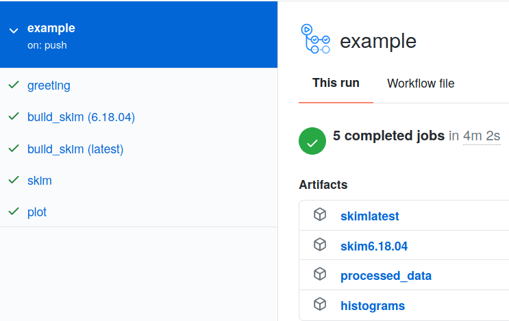

# Making Plots to Take Over The World

:::{admonition} Overview
:class: note
**Teaching:** 5 min | **Exercises:** 10 min

**Questions**
- How do we make plots?

**Objectives**
- Use everything you learned to make plots!
:::

## On Your Own

So in order to make plots, we just need to take the skimmed file `skim_ggH.root` and pass it through the `histograms.py` code that exists. This can be run with the following code

```bash
python histograms.py skim_ggH.root ggH hist_ggH.root
```

This needs to be added to your `.github/workflows/main.yml` which should look like the following:

```yaml
jobs:
  greeting:
    runs-on: ubuntu-latest
    steps:
      - run: echo hello world

  build_skim:
    needs: greeting
    runs-on: ubuntu-latest
    container: rootproject/root:${{ matrix.version }}
    strategy:
      matrix:
        version: [6.26.10-conda, latest]
    steps:
      - name: checkout repository
        uses: actions/checkout@v4

      - name: build
        run: |
          COMPILER=$(root-config --cxx)
          FLAGS=$(root-config --cflags --libs)
          $COMPILER -g -O3 -Wall -Wextra -Wpedantic -o skim skim.cxx $FLAGS

      - uses: actions/upload-artifact@v4
        with:
          name: skim${{ matrix.version }}
          path: skim

  skim:
    needs: build_skim
    runs-on: ubuntu-latest
    container: rootproject/root:6.26.10-conda
    steps:
      - name: checkout repository
        uses: actions/checkout@v4

      - uses: actions/download-artifact@v4
        with:
          name: skim6.26.10

      - name: skim
        run: |
          chmod +x ./skim
         ./skim root://eospublic.cern.ch//eos/root-eos/HiggsTauTauReduced/GluGluToHToTauTau.root skim_ggH.root 19.6 11467.0 0.1

      - uses: actions/upload-artifact@v4
        with:
          name: skim_ggH
          path: skim_ggH.root
```

::::{admonition} Adding Artifacts
:class: important
So we need to do a two things:

1. add a `plot` job
2. save the output `hist_ggH.root` as an artifact

You know what? While you're at it, why not delete the `greeting` job and multi versions job as well? There's no need for it anymore 🙂.

:::{admonition} Solution
:class: dropdown
```yaml
...
...
...
 skim:
   needs: build_skim
   runs-on: ubuntu-latest
   container: rootproject/root:6.26.10-conda
   steps:
     - name: checkout repository
       uses: actions/checkout@v4

    - uses: actions/download-artifact@v4
      with:
        name: skim6.26.10

    - name: skim
      run: |
        chmod +x ./skim
        ./skim root://eospublic.cern.ch//eos/root-eos/HiggsTauTauReduced/GluGluToHToTauTau.root skim_ggH.root 19.6 11467.0 0.1

    - uses: actions/upload-artifact@v4
      with:
        name: skim_ggH
        path: skim_ggH.root

 plot:
   needs: skim
   runs-on: ubuntu-latest
   container: rootproject/root:6.26.10
   steps:
     - name: checkout repository
       uses: actions/checkout@v4

    - uses: actions/download-artifact@v4
      with:
        name: skim_ggH

    - name: plot
      run: python histograms.py skim_ggH.root ggH hist_ggH.root

    - uses: actions/upload-artifact@v4
      with:
        name: histograms
        path: hist_ggH.root
```
:::
::::

<!--

-->

Once we're done, we should probably start thinking about how to test some of these outputs we've made. We now have a skimmed ggH ROOT file and a file of histograms of the skimmed ggH.

:::{admonition} Are we testing anything?
:class: tip
Integration testing is actually testing that the scripts we have still run. So we are constantly testing as we go here which is nice. Additionally, there's also continuous deployment because we've been making artifacts that are passed to other jobs. There are many ways to deploy the results of the code base, such as pushing to a web server and so on. Artifacts are one way to deploy.
:::

:::{admonition} Key Points
:class: note
- Another action, another job, another artifact.
:::
