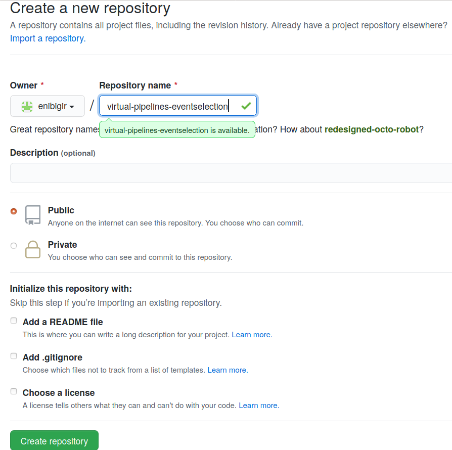

# Setup

## Set up Python

Part of this lesson consists in learning how to make scripts exit correctly. At some point, we will need to test exit codes with Pytest, Python testing tool.

To know whether your Python has `pytest`, just run `python3 -c "import pytest"`. If this command returns nothing, it means everything is fine. Otherwise, it can be installed by running `python3 -m pip install -U pytest`. More information can be found in the [`pytest` website](https://docs.pytest.org/en/stable/getting-started.html) for installation.

## Set up the code

- Create a new repository on your personal GitHub account and name it `virtual-pipelines-eventselection`.

  :::{admonition} Visibility
  :class: tip
  Make sure you click Public for the visibility level of the new repository so that everyone can see your awesome work.
  :::

  

- Get the code

  Open a terminal and clone the repository that contains files required for this lesson.

  ```bash
  git clone git@github.com:hsf-training/hsf-training-cms-analysis.git virtual-pipelines-eventselection
  cd virtual-pipelines-eventselection
  ```

  :::{admonition} HTTPS instead of SSH
  :class: tip
  The commands above use SSH URLs, which require an [SSH key set up with your GitHub account](https://docs.github.com/en/authentication/connecting-to-github-with-ssh). If you authenticate over HTTPS instead (e.g. with the `gh` CLI or a credential manager), clone with

  ```bash
  git clone https://github.com/hsf-training/hsf-training-cms-analysis.git virtual-pipelines-eventselection
  ```

  and use `https://github.com/<GitHub username>/virtual-pipelines-eventselection.git` in the `git remote set-url` command below.
  :::

- Add the code to your personal GitHub account

  At the moment, your clone is the remote repository stored on someone else's GitHub account. To get the name of the existing remote use
  ```bash
  git remote -v # -v stands for verbose
  ```

  ```text
  origin	git@github.com:hsf-training/hsf-training-cms-analysis.git (fetch)
  origin	git@github.com:hsf-training/hsf-training-cms-analysis.git (push)
  ```

  You have to change remote's URL in order to be able to add the code to your personal GitHub account.

  ```bash
  git remote set-url origin git@github.com:<GitHub username>/virtual-pipelines-eventselection.git
  ```
  Check again the name of the current remote:
  ```bash
  git remote -v
  ```

  The last step is to rename the branch to main, and push it to GitHub.
  ```bash
  git branch -M main
  git push -u origin main
  ```
  This will add the code to your new repository on GitHub. Done!

If you're having issues, **please let us know immediately**
since you might not be able to follow this lesson without a proper setup.
